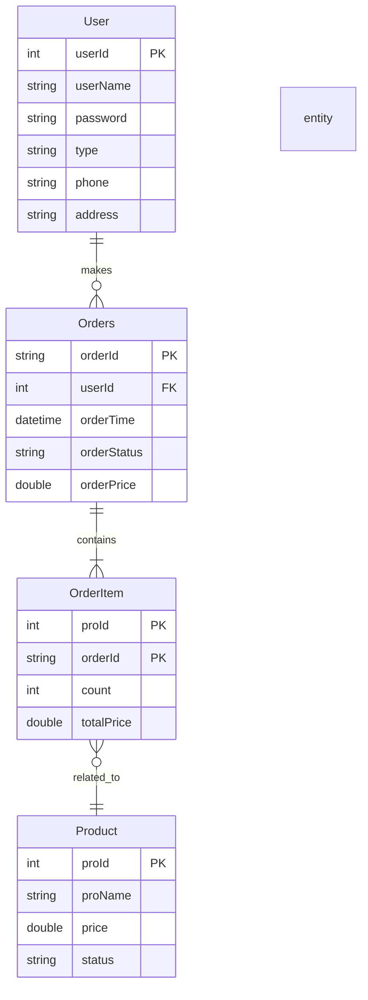

```mermaid
erDiagram 
    User ||--o{ Orders : makes
    Orders ||--|{ OrderItem : contains
    OrderItem }o--|| Product : related_to

    entity User {
        int userId PK
        string userName
        string password
        string type
        string phone
        string address
    }

    entity Orders {
        string orderId PK
        int userId FK
        datetime orderTime
        string orderStatus
        double orderPrice
    }

    entity OrderItem {
        int proId PK
        string orderId PK
        int count
        double totalPrice
    }

    entity Product {
        int proId PK
        string proName
        double price
        string status
    }
```